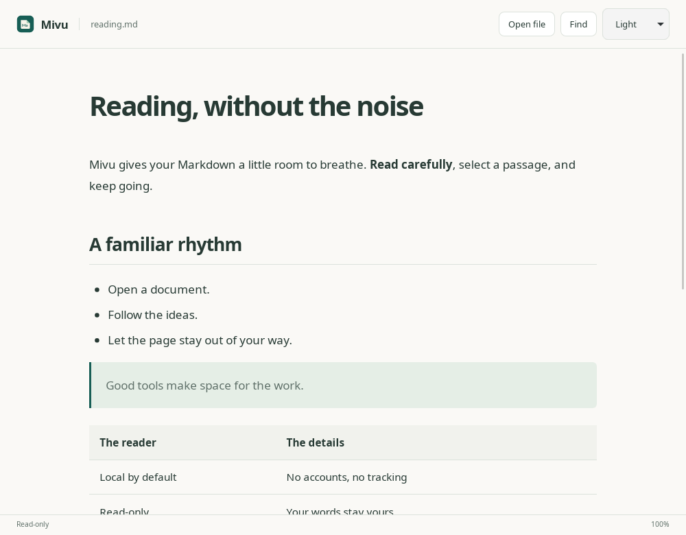
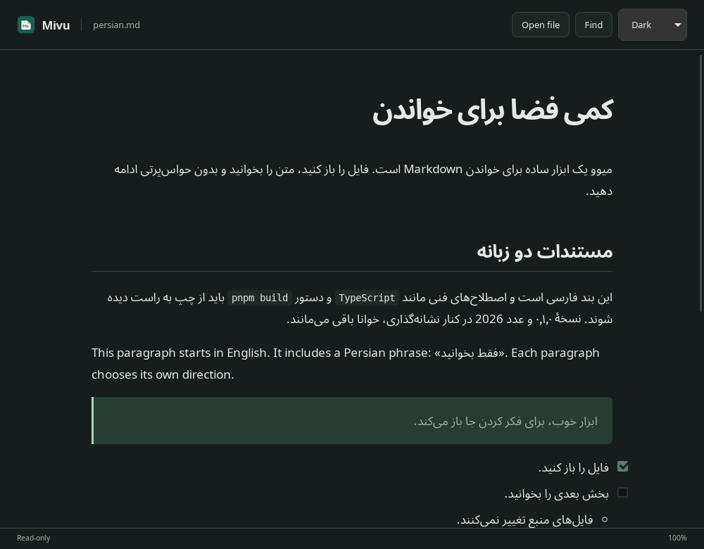
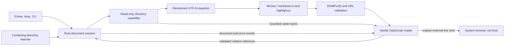

# Mivu

**Just read Markdown.**

A minimal, beautiful, read-only Markdown reader for Linux. Mivu uses Tauri 2, Rust, and vanilla TypeScript to bring local Markdown into a calm desktop reading window. Open source under the MIT license, with no accounts, telemetry, or network-loaded assets.

**v0.1.0 is a release candidate under validation, not a published stable release.** Native WebKit automation runs on Zorin OS 18.1. Human desktop acceptance and older-distribution compatibility remain release gates; see [validation](#validation-and-manual-desktop-checklist).

## Features

Implemented:

- Native file picker, drag-and-drop, `.md` and `.markdown`, UTF-8 and Unicode paths.
- Startup file arguments and forwarding to the existing application window.
- GFM headings, tables, nested lists, disabled task lists, strikethrough, autolinks, links, and images.
- Syntax highlighting for Bash, CSS, JavaScript, JSON, Python, Rust, TypeScript, and XML/HTML; other languages remain readable plain code.
- Constrained relative Markdown links and local PNG/JPEG/GIF/WebP images.
- System, light, and dark themes; comfortable typography, scrolling, text selection and copying.
- Persian, Arabic-script, English, and mixed-language blocks; code remains left-to-right.
- Literal document search, keyboard shortcuts, and reading zoom.
- Debounced external-change refresh, including atomic saves, with scroll preservation.
- Debian/AppImage packaging configuration, desktop entry, and Markdown MIME registration.

Remote images, SVG images, raw HTML, editing/saving, code execution, accounts, cloud synchronization, databases, telemetry, plugins, and terminals are intentionally outside v0.1. Mermaid diagrams and mathematics are proposed future features, not currently rendered.

## Screenshots

Actual Mivu screenshots from the Linux WebKit window on an isolated X11 display on Zorin OS 18.1. These are application captures, not mockups.




## Installation

Use artifacts from an intentionally tagged, verified release when available. No stable release has been published as part of this implementation. Build locally with the commands below if you want to evaluate the candidate.

### Debian / Ubuntu / Zorin

From the directory containing the package:

```sh
sudo apt install ./Mivu_0.1.0_amd64.deb
mivu README.md
```

The package installs `mivu`, a menu launcher, icons, and a MIME definition. GTK 3, WebKitGTK 4.1, libxdo, shared-mime-info, and a suitable glibc are runtime dependencies; apt resolves them. The package records its build host's minimum glibc version conservatively. A package built on Ubuntu 24.04 must not be advertised as Ubuntu 22.04 compatible. CI builds on Ubuntu 22.04 to establish the older baseline; Debian 12 and Ubuntu 22.04 still require actual installation checks before claiming support.

Mivu appears in **Open With**. Installation never changes your default Markdown handler. To make double-clicks open Mivu, select it yourself in the file manager's file-properties/default-application UI.

Uninstall:

```sh
sudo apt remove mivu
```

This removes the application, not your Markdown files. Theme preferences and WebKit caches under your XDG application directories can remain.

### AppImage

```sh
chmod +x Mivu_0.1.0_amd64.AppImage
./Mivu_0.1.0_amd64.AppImage README.md
```

AppImage retains the build host's glibc baseline. It does not automatically install desktop associations. If FUSE 2 is unavailable, use the supported extraction mode:

```sh
APPIMAGE_EXTRACT_AND_RUN=1 ./Mivu_0.1.0_amd64.AppImage README.md
```

On Ubuntu 24.04, `libfuse2t64` enables normal FUSE execution. Do not remove your system's FUSE 3 package. Delete the AppImage to uninstall it.

## Usage

Launch **Mivu** from the application menu, choose **Open**, or drop one Markdown document into the window. Opening another document replaces the current view; Mivu does not save or modify it. Empty files and failed opens have explicit states; a failed open preserves the previous document.

```sh
mivu README.md
mivu '/home/you/Documents/راهنما with spaces.markdown'
```

One file argument is supported, relative to the invoking directory. A second launch sends its file to the existing instance and requests foreground focus; a compositor may restrict focus stealing.

The appearance selector chooses system, light, or dark. The choice persists locally. Filesystem changes refresh automatically after a short debounce. Deleted or unreadable documents show an error while retaining the last readable view; restoration can recover automatically. Reopen a file if its containing directory was moved or a watcher failed.

| Shortcut                       | Action                            |
| ------------------------------ | --------------------------------- |
| Ctrl+O                         | Native open dialog                |
| Ctrl+F                         | Find literal text in the document |
| Enter / Shift+Enter in search  | Next / previous match             |
| Escape                         | Close search                      |
| Ctrl++ / Ctrl+-                | Increase / decrease reading size  |
| Ctrl+0                         | Reset reading size                |
| Ctrl+C                         | Copy selected text                |
| Arrows, Page Up/Down, Home/End | Standard keyboard scrolling       |

The application handles Command in place of Ctrl for its own shortcuts on future macOS builds. Search spans inline formatting, stays inside text blocks, and caps visible results at 2,000, reporting the cap. Reading size ranges from 60% to 180%.

Relative links resolve from the current document directory inside the originally selected document's folder. Clicking a local Markdown link opens it through Rust validation. Heading links scroll inside the view. HTTP(S) and mail links open the system browser/mail application only after a user click. Remote images show a blocked-content placeholder and never fetch automatically.

## Development setup

On Ubuntu 24.04 / Zorin OS 18.1:

```sh
sudo apt update
sudo apt install --no-install-recommends build-essential pkg-config libssl-dev libgtk-3-dev libwebkit2gtk-4.1-dev librsvg2-dev libxdo-dev patchelf python3
```

Install Rust stable with rustup and Node.js 24.12 or later (Node 24 LTS recommended). Rust 1.90 is the declared minimum; the current stable toolchain is used in CI. Install the pinned pnpm version, then clone and run:

```sh
npm install --global pnpm@12.10.1
git clone https://github.com/aminbahrabadi/mivu.git
cd mivu
# Until the candidate PR is merged:
git switch feat/linux-v0.1
pnpm install --frozen-lockfile
pnpm tauri dev
```

If global npm installation is inappropriate, run commands through `npm exec --yes --package=pnpm@12.10.1 -- pnpm ...`. Development serves only on `127.0.0.1:1420`. Production contains the assets and runs offline. Network access is needed to install dependencies and download packaging tools, not to read documents.

For native automated tests:

```sh
sudo apt install --no-install-recommends dbus-daemon webkit2gtk-driver xvfb xauth python3-gi gir1.2-gtk-3.0 x11-utils desktop-file-utils shared-mime-info
pnpm tauri build --debug --no-bundle --ci -- --locked
pnpm test:native
```

The native harness needs Linux X11 and uses Xvfb, the system WebKitWebDriver, and libxdo. No browser download or Node browser framework is required. For real screenshots, pass `--screenshots docs/screenshots` explicitly; normal tests write only ignored `test-results/` artifacts.

## Architecture



### Responsibilities and state

Rust owns selected paths, the current `OpenDocument`, a directory capability, revision numbers, image budget, watcher generation, and a single watcher. A mutex serializes native document transitions. Blocking picker, filesystem reads, and second-instance work run outside the UI thread. Only five application commands are exposed: `pick_document`, `current_document`, `open_relative`, `read_image`, and `open_external`.

TypeScript owns the toolbar, rendered article, current snapshot, search UI, and reading size. There is no global state library. Revision numbers reject stale snapshots and image replies. A new document focuses the reader; refreshing the same path preserves scroll and search focus. Theme selection uses localStorage and CSS variables; system appearance follows `prefers-color-scheme` only when selected.

### File-to-view pipeline

1. The native picker, native drop event, or command-line launch explicitly supplies a path.
2. Rust validates the extension and regular-file type, resolves the selected file, and opens its parent as a `cap-std` directory capability.
3. A bounded read accepts valid UTF-8, strips an optional UTF-8 BOM, and publishes a revisioned snapshot. Failed opens retain the previous snapshot.
4. A dedicated worker parses with raw HTML disabled; eight explicit highlight.js grammars color supported fenced code. It emits complete top-level blocks in small batches with frontend backpressure. DOMPurify sanitizes each batch before insertion; no worker HTML bypasses the sanitizer. Switching documents terminates obsolete workers.
5. The renderer validates links, assigns unique heading IDs, sets `dir="auto"` per text block and table cell, and sets code to `dir="ltr"`. The reader inserts sanitized fragments between animation frames, keeping long-document parsing off the UI thread. A single enormous nested block can still require a larger insertion.
6. Images initially have inert references, never document-provided `src` URLs. A small worker pool requests bounded raster bytes from Rust and inserts validated data URLs. Stale responses are discarded.

### Watcher lifecycle

The watcher observes the active document's containing directory, rather than its inode, so atomic rename replacement is detected. It filters access and unrelated-file events, coalesces noisy changes for 180 ms, and imposes a 600 ms maximum debounce to avoid starvation. A bounded event queue limits retained work. Each switch drops the previous watcher and advances a generation; obsolete callbacks cannot refresh the new document. Closing the window drops the watcher. Unchanged contents avoid rerendering. Errors are deduplicated, and recovery clears the error.

### Security model

Every document and reference is untrusted. Native directory capabilities constrain linked Markdown and image access to the initially selected folder, including symlink resolution and replacement races. Opening a new file with the picker/drop/CLI establishes a new boundary. Links into parent folders outside that boundary require explicit selection with Open. This deliberately trades unrestricted README traversal for predictable local-file privacy.

- Source files are opened with read-only options; no write/save command exists.
- Documents are limited to 8 MiB and must be regular UTF-8 files. Unix nonblocking opens avoid hanging on a replacement FIFO.
- Images are limited to 4 MiB each, 24 MiB of native bytes per document revision, and 128 image elements. PNG/JPEG/GIF/WebP signatures must match the extension. SVG and remote images are blocked.
- Raw HTML is disabled; an explicit sanitizer allowlist removes active markup, inline handlers, styles, and document-provided image sources. Task checkboxes are disabled.
- Unsafe schemes, absolute filesystem references, malformed escapes, credentials in external URLs, and traversal escapes are rejected. Rust validates native boundaries independently of frontend checks.
- Capabilities grant only these reader commands and event subscriptions. The renderer has no unrestricted filesystem, shell, dialog-plugin, or network API.
- Production CSP restricts scripts/assets to the application, denies frames/objects/forms, and permits only Tauri IPC connections. Trusted inline style updates support reading zoom; untrusted Markdown styles are removed. Native navigation permits only the application origin.
- External HTTP(S)/mailto navigation is delegated to a system application after a trusted user click. Private document contents are not logged.

This is not an OS sandbox for the whole process. WebKit and raster decoding remain system dependencies, malformed inputs can consume resources within the limits, and very large DOMs can slow reading. A compressed image's dimensions are not currently bounded. Keep system security updates current. See [SECURITY.md](SECURITY.md) for disclosure and support.

### Linux integration and portability

Linux packaging owns the freedesktop launcher, MIME XML, icons, and database-update maintainer scripts. `Exec=mivu %f` passes one file without shell interpolation. The single-instance plugin forwards later launch arguments and their working directory. AppImage startup temporarily restores the runtime-provided `OWD` (or preserved `PWD` in older extraction runtimes) for forwarding and captures it for initial arguments. It then returns to AppRun's directory before creating the WebKit view, whose bundled helper paths are relative. Native GTK drops and file selection share the same validated opening flow.

Document validation, rendering, themes, and search are portable. CLI/path processing uses native path types. Windows/macOS icon assets exist, and platform libraries are isolated in Rust/Tauri and Linux bundle configuration. Windows/macOS builds, native associations, signed installers, and their lifecycle differences are future validation work; no cross-platform release is claimed. Non-UTF-8 filenames are not a supported v0.1 interface, although Unicode filenames are supported.

## Repository structure

```text
mivu/
├── src/
│   ├── main.ts, app.ts              # startup, toolbar, events and reader state
│   ├── core/                       # snapshots, parser/worker, batching, sanitizer, references
│   ├── features/                   # search and appearance
│   ├── ui/                         # empty state, images and fragment scrolling
│   └── styles/                     # shared layout, Markdown typography, themes
├── src-tauri/
│   ├── src/                        # lifecycle, commands, documents, CLI, watcher, security
│   ├── capabilities/, permissions/ # narrow IPC grants
│   ├── icons/                      # project-owned native assets
│   ├── tauri.conf.json             # application, window and CSP configuration
│   ├── tauri.linux.conf.json        # Linux packaging
│   └── mivu.desktop, mivu-mime.xml  # desktop and MIME integration
├── tests/                          # Vitest tests, benchmark and realistic fixtures
├── scripts/                        # native smoke, benchmarks and package checks
├── assets/mivu.svg                 # original icon source
├── docs/screenshots/               # actual application captures
├── .github/workflows/              # quality, artifacts and tagged release draft
├── README.md                       # canonical product and architecture documentation
├── AGENTS.md, CONTRIBUTING.md, SECURITY.md, CHANGELOG.md
└── LICENSE                         # original MIT license
```

## Architectural decisions

- **Tauri rather than Electron:** reuse the system WebKit renderer and keep native file access in Rust. This avoids shipping Chromium/Node, but Linux behavior and security updates depend on the distribution's WebKitGTK.
- **Vanilla TypeScript rather than a framework:** a toolbar and one document view need little state. Explicit DOM modules keep the dependency and maintenance cost small. Large future UI changes should reassess this decision with evidence.
- **markdown-it rather than a custom parser:** established Markdown/GFM behavior, extensible rendering rules, and tested parsing. DOMPurify adds defense in depth rather than assuming parser output is sufficient.
- **Linux first:** validate actual GTK/WebKit, freedesktop, and distribution behavior before advertising more platforms. An older CI build host avoids assuming a newer glibc binary works everywhere.
- **Read-only capabilities:** explicitly selected documents authorize a bounded directory scope; the renderer cannot request arbitrary paths. This makes security properties inspectable and testable.
- **Minimal dependencies:** no UI framework, persistence service, browser test framework, or extension system. `cap-std` is a deliberate addition for race-resistant filesystem boundaries; `notify` handles native watcher differences.

## Testing and benchmarks

```sh
pnpm check             # strict TypeScript, ESLint, Vitest, production frontend
pnpm format:check      # Prettier
pnpm check:rust        # rustfmt, Clippy with denied warnings, cargo tests
pnpm test:native       # after building the debug binary
pnpm bench             # jsdom render/sanitize microbenchmarks
pnpm bench:native      # after building the release binary
```

Frontend tests exercise GFM, malicious HTML/URLs, reference classification, direction attributes, heading anchors, search across formatting, theme selection, failed opens, refresh state, and stale responses. Rust tests exercise limits, UTF-8, supported extensions, permission errors, regular-file validation, relative capability boundaries, symlinks/FIFOs, CLI paths, external URLs, navigation, and watcher replacement/debounce/cleanup.

Native automation runs the actual packaged WebKit application: GTK selection and file drag, local raster decoding, link navigation, RTL/LTR computed directions, resizing, search/zoom, second-instance and startup arguments, external writes/atomic saves/deletion/recovery, package launcher/MIME identification, denied filesystem IPC, and blocked origin navigation. It uses copied temporary documents, isolated XDG state, and a private D-Bus session without host service activation; it never changes your default handler.

Reproduce a failure with the same command and OS/WebKit versions. Native logs, screenshots, benchmark JSON, and package manifests are under ignored `test-results/`. A port collision or missing test package is a harness failure, not evidence that the application passed.

Benchmarks generate representative GFM from `tests/fixtures/reading.md`. Native timings include second-instance IPC, parsing, sanitization, and DOM insertion, with three samples per size. Startup measures process-cold launches with warm OS caches, including WebDriver negotiation; it is not a disk-cold startup claim. Process-tree RSS double-counts shared pages. Measurements and conditions are recorded in [docs/validation.md](docs/validation.md); microbenchmarks under jsdom are not desktop timing predictions.

## Building and releasing

```sh
pnpm build                             # frontend only
pnpm tauri build --debug --no-bundle    # development desktop executable
pnpm package:deb                       # optimized executable and .deb
APPIMAGE_EXTRACT_AND_RUN=1 pnpm package:appimage
APPIMAGE_EXTRACT_AND_RUN=1 pnpm package:linux
python3 scripts/inspect_packages.py
```

Outputs are under `src-tauri/target/release/bundle/deb/` and `appimage/`. The package helper supplies a conservative host glibc dependency and locked Rust resolution. AppImage bundling downloads upstream Linuxdeploy tools and can require the extraction environment setting shown above. Package inspection asserts identity, integration files, dependencies, and AppImage headers, then records SHA-256 checksums. To exercise the Debian package without installing it:

```sh
dbus-run-session --config-file=scripts/dbus-test.conf -- xvfb-run -a python3 scripts/native_smoke.py --deb src-tauri/target/release/bundle/deb/Mivu_0.1.0_amd64.deb
```

GitHub Actions runs frontend/Rust quality and native WebKit tests on pull requests. Branch/manual/tag builds additionally produce packages on Ubuntu 22.04, smoke-test Debian and AppImage packages, inspect artifacts, and upload them. Actions are pinned to commit SHAs, checkout credentials are not persisted, and ordinary jobs have read-only repository permissions.

Version numbers in package.json, Cargo.toml, tauri.conf.json, lockfiles, and CHANGELOG.md must agree. After all automated and manual release gates pass, a maintainer intentionally pushes a matching `vX.Y.Z` tag. The tag workflow verifies versions and creates a **draft** release with the verified CI artifacts; publishing is a separate maintainer action after checking installation and portability. No public release is created automatically on main or during implementation. Do not upload newer-host binaries as older-compatible artifacts.

## Validation and manual desktop checklist

Automated evidence and exact limitations live in [docs/validation.md](docs/validation.md). A successful build alone does not complete the release gate.

On a clean Zorin OS 18.1 installation:

1. Install the verified `.deb` using apt; confirm Mivu appears in the menu with its icon. Launch from the menu and terminal.
2. Use Open and drop `tests/fixtures/reading.md`; check tables, disabled tasks, code scrolling, local images, selection/copy, and an explicitly clicked external link.
3. Open `tests/fixtures/persian.md` in both appearances. Check mixed punctuation, inline English, table cells, LTR code, and comfortable narrow/wide layouts.
4. Test all shortcuts, tab focus, keyboard scrolling, system theme changes, zoom reset, and screen-reader announcements/focus.
5. Copy a fixture to a path with spaces and Persian characters and test `mivu 'path'`, Open With, and double-click after deliberately selecting Mivu as its handler. Confirm installation did not change existing defaults.
6. Modify only the copied fixture externally; test normal writes, atomic replacement, deletion and restoration. Check refresh, scroll preservation, errors, and switching documents repeatedly.
7. Repeat launch, drop, foreground requests and resizing in Wayland and Xorg sessions, and on actual high-DPI/fractional-scale displays. Check compositor behavior and rendering.
8. Run the adversarial fixture and confirm no script or remote image loads. Verify source fixture hashes are unchanged after reading.
9. Uninstall and confirm source documents remain. Repeat installation on Ubuntu 22.04 and Debian 12 using the older-host CI package before declaring those systems supported.

## Roadmap

| Phase | Implementation                     | Validation status                                                                                        |
| ----- | ---------------------------------- | -------------------------------------------------------------------------------------------------------- |
| 0     | Project initialization and tooling | Implemented; builds and initial Linux development launch checked                                         |
| 1     | Native foundation and file access  | Implemented; native picker/drop and validation checked                                                   |
| 2     | Markdown engine                    | Implemented; frontend and native rendering checked                                                       |
| 3     | Reading experience, themes and RTL | Implemented; automation and actual screenshots checked; human accessibility/long-session review pending  |
| 4     | Linux integration and refresh      | Implemented; CLI, watcher and isolated package launch checked; installed file-manager acceptance pending |
| 5     | Security and robustness            | Implemented; adversarial frontend/Rust/native checks passed; decoder/DoS limits documented               |
| 6     | Tests, QA and performance          | Automated checks and reproducible benchmark tooling implemented; current evidence in validation report   |
| 7     | Linux packages and release CI      | Packaging/workflows implemented; artifact evidence and remaining release gates in validation report      |

Proposals, not commitments: v0.2 Mermaid and mathematical notation; v0.3 optional document outline; v0.4 multiple document tabs; future Windows/macOS builds. These need scope and security review before implementation.

## Contributing

Small improvements to reading quality, security, accessibility, and Linux reliability are welcome. See [CONTRIBUTING.md](CONTRIBUTING.md) for setup, tests, issue/PR expectations and review guidelines, and [AGENTS.md](AGENTS.md) for repository instructions.

## Security

Please report vulnerabilities through [SECURITY.md](SECURITY.md). Never attach private documents to a public issue. The security model above explains the selected-folder boundary, offline behavior, native permissions, and limits; it does not promise complete isolation from WebKit or operating-system vulnerabilities.

## License

[MIT](LICENSE). Copyright 2026 Amin Bahrabadi. The existing license is preserved.
