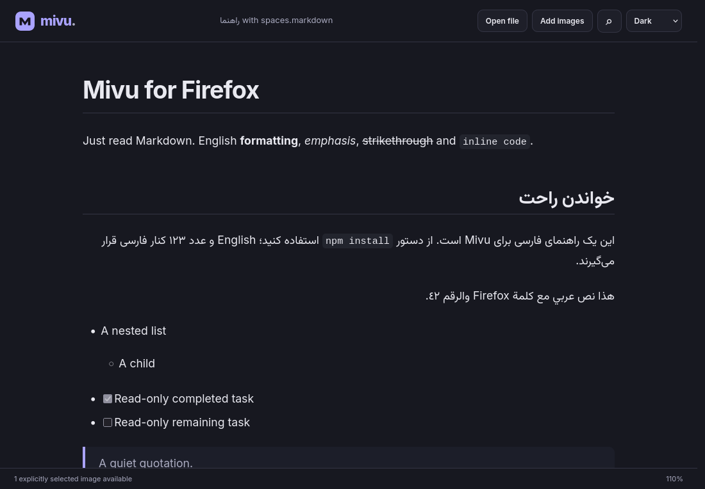
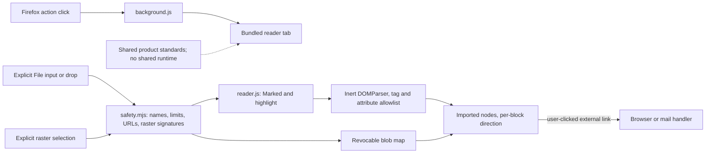

# Mivu for Firefox

**Just read Markdown.** A minimal, beautiful, read-only reader in its own Firefox
tab. Documents remain local; no accounts, backend, telemetry, remote scripts,
document uploads or native application are involved. [Mivu Desktop](../README.md)
is an independent application with the same product principles.

Firefox **0.1.0 was submitted to Mozilla and is awaiting review**, according to
the supplied submission record. There is no verified public AMO listing to link
here yet. This directory preserves the submitted runtime byte-for-byte; tests,
build safeguards and documentation are repository additions. Future runtime
changes require a new Firefox version, independently of Desktop's version.



The screenshot was captured from Firefox 155.0.1, not a mockup. A
[light screenshot](docs/screenshots/reader-light.png) is also available.

## Features and browser compatibility

Inspected and tested:

- Explicitly choose or drop UTF-8 `.md` / `.markdown` files, including Unicode filenames.
- GFM headings, lists/nesting, tables, quotes, strikethrough, disabled task lists,
  inline/fenced code, external links and selected raster images.
- Bundled Marked 4.0.19 and a highlight.js 11.0.1-declared bundle with 34 grammars.
  Supported fences emit token spans; current CSS leaves code monochrome.
- System/light/dark appearance with local preference persistence, system fonts,
  selectable text, readable line lengths and scrolling code/tables.
- Per-block Persian/Arabic/English direction; inline/fenced code stays LTR.
- Literal, case-insensitive per-text-node search, navigation and reading zoom.
- Friendly file/type/UTF-8/size errors; no editing or saving.

Manifest V3 declares Firefox **128.0 minimum**. Actual browser automation ran on
155.0.1 on Zorin OS 18.1. Firefox 128, ESR and Android are not tested. The
no-collection declaration is supported from desktop 140 / Android 142;
[Mozilla's documentation](https://extensionworkshop.com/documentation/develop/firefox-builtin-data-consent/)
explains these compatibility boundaries. Older versions still have no collection
code but may ignore the declaration. Mozilla lint emits these two warnings.

## Permissions and privacy

```json
"permissions": [],
"host_permissions": []
```

Under `browser_specific_settings.gecko`:

```json
"data_collection_permissions": { "required": ["none"] }
```

Opening a tab for the extension's own `reader.html` does not need `tabs` access.
There are no content scripts, optional permissions, host access, visited-site
scanning, native messaging or unrestricted local-file access. Theme uses page
localStorage, not the WebExtensions `storage` permission. Documents/images are
not persisted. All libraries, fonts and icons are local/system assets. An
external link click can send its URL to the destination or mail application;
there are no automatic document network requests.

## Security model

Every document and selected image is untrusted. Raw Markdown HTML is suppressed.
Generated HTML is parsed into inert nodes, reduced with an element/attribute
allowlist and imported without HTML assignment sinks or a serialize/reparse step.
SVG/MathML, handlers, forms, active embeds and clobbering attributes are removed.
Unsafe/local links become text. Task checkboxes stay disabled. Code highlighting
only produces markup that passes through the same sanitizer.

Local images are placeholders until **Add images** explicitly supplies the
corresponding files. References are matched by case-insensitive basename;
`images/photo.png` may use selected `photo.png`, but cannot open a directory or
follow symlinks. Duplicate filenames, traversal and remote references are
rejected. PNG/JPEG/GIF/WebP signatures must match extensions. Images use revocable
blob URLs, not arbitrary paths or remote fetches.

Limits: **8 MiB** UTF-8 Markdown, **12 MiB** per image, **30** selected images,
**500** search matches, query UI limit **120** characters. Image pixel dimensions
and a separate aggregate memory budget are not bounded. Parsing is synchronous
on the page thread, so dense/large documents can stall the tab. These limits are
not a denial-of-service sandbox. Keep Firefox updated.

CSP permits bundled scripts/styles and self/blob/data images; it denies network
connections, objects, forms and base changes. Browser navigation remains possible
for explicitly clicked external HTTP(S)/mailto links. See the complete
[implementation review and findings](docs/audit.md) and [SECURITY.md](../SECURITY.md).
The review does not establish that the extension is vulnerability-free.

## Architecture and file responsibilities



| File                             | Responsibility                                                                             |
| -------------------------------- | ------------------------------------------------------------------------------------------ |
| `app/manifest.json`              | MV3, identity/version, zero permissions, Gecko declaration and CSP                         |
| `app/background.js`              | Opens its own reader on the action click                                                   |
| `app/reader.html`                | Accessible toolbar, file inputs, article, search and status/error regions                  |
| `app/reader.js`                  | Bounded reads, renderer/sanitizer, images, page state, search, zoom, theme and drop events |
| `app/safety.mjs`                 | Pure filename, URL, image-reference and raster-signature policy                            |
| `app/styles.css`, `app/icons/`   | Existing Firefox appearance, system-font/RTL styles and original Mivu icon                 |
| `app/vendor/`                    | Submitted parser/highlighter assets and original notices                                   |
| `third-party/`                   | Full supplemental BSD license, readable bundle copy and provenance/gaps                    |
| `tools/build_amo.py`             | Offline deterministic AMO/source ZIP packaging, validation and release-byte guard          |
| `tools/browser_smoke.py`         | Actual Firefox/WebDriver smoke test with temporary profile and loopback fixture            |
| `tests/`                         | Node reader/security tests, Python package tests, realistic/adversarial fixtures           |
| `releases/v0.1.0-submitted.json` | Immutable-submission hash and complete runtime inventory                                   |

Small page-local state holds one source/file, image map, search marks and zoom.
Successful Markdown reads revoke previous images. Image selection replaces the
map transactionally after validation. Blob URLs are revoked on failure, switching
and pagehide. **Known race:** image reads are asynchronous without a document
revision check; wait for their status message before switching documents.

No shared runtime package exists. Firefox uses browser `File` objects and its
own sanitizer; Desktop uses Rust directory capabilities, markdown-it and DOMPurify.
Shared standards are conceptual: calm system typography, read-only tasks, clear
focus states, offline privacy and per-block direction. Purple Firefox tokens and
its existing icon are preserved; redesign is not part of historical integration.

## Development and local testing

Packaging needs only **Python 3.10+**, using the standard library, on any OS.
No npm install or internet access is required to produce an AMO ZIP.

From the repository root:

```sh
python3 firefox/tools/build_amo.py
python3 -m unittest discover -s firefox/tests -p 'test_*.py' -v
node --test firefox/tests/safety.test.mjs
```

The full reader suite reuses the repository's existing jsdom development dependency:

```sh
pnpm install --frozen-lockfile
node --test firefox/tests/*.test.mjs
node --check firefox/app/reader.js
node --check firefox/app/background.js
node --check firefox/app/safety.mjs
```

No extension runtime npm dependency or bundler is added. Root ESLint/Prettier skip
the submitted runtime and derived third-party sources so formatting cannot alter
historical bytes; Firefox syntax, behavior, policy and ZIP checks run separately.
Tests load the actual parser/highlighter/reader body, not a reimplemented renderer.
See [tests and remaining validation](docs/audit.md#executed-checks).

Temporary installation: open `about:debugging#/runtime/this-firefox`, choose
**Load Temporary Add-on**, select `firefox/app/manifest.json` (or the built ZIP),
and click Mivu's extension action. Temporary extensions disappear after restart;
reload from that page when developing. A signed/public install will use Mozilla
Add-ons once approved; no AMO approval or download URL is invented here.

For browser automation, install Firefox and
[geckodriver](https://github.com/mozilla/geckodriver/releases) 0.37.1 in your PATH:

```sh
python3 firefox/tools/build_amo.py
python3 firefox/tools/browser_smoke.py
# Explicit binaries also work:
python3 firefox/tools/browser_smoke.py --driver /path/to/geckodriver --firefox /path/to/firefox
```

It uses headless Firefox, Python's HTTP client and a fresh throwaway profile.
No Selenium dependency, existing profile or system preference changes are needed.
Firefox prevents WebDriver content navigation to extension URLs, so this isolated
harness uses geckodriver's `--allow-system-access` for initial Gecko UI navigation;
do not expose the driver beyond localhost. This grants the **test driver**, not
the extension, privileged access. Screenshots/logs/JSON go to `test-results/firefox/`.
Native OS drag, browser toolbar and human accessibility checks remain manual.

## Build, AMO packaging and historical reproduction

The original command remains supported from this directory:

```sh
python3 tools/build_amo.py
```

Outputs under ignored `firefox/dist/`:

- `mivu-firefox-AMO-upload-v0.1.0-security-fixed.zip`: 11 runtime files, manifest at root.
- `mivu-firefox-source-v0.1.0.zip`: Firefox source/tools/tests/reviewer materials and MIT license.

The builder rejects missing assets, unsafe paths/symlinks, unexpected runtime
files, permission/data/CSP changes and unsafe HTML assignment patterns. Full
behavioral tests are still required; this pattern check alone is not a sanitizer.
Files are sorted with fixed timestamps and permissions. ZIP bytes are deterministic
for identical source/tool/compression versions; cross-version zlib byte identity
is not promised. Every v0.1.0 runtime file must match the recorded submission
hash, preventing accidental edits with an unchanged release version.

Recheck the original submitted artifact when you have it:

```sh
python3 firefox/tools/build_amo.py --verify-submitted /path/to/mivu-firefox-AMO-upload-v0.1.0-security-fixed.zip
```

All 11 decompressed file paths/sizes/hashes matched the original build and the
hardened build. Archive timestamps differ; the original submitted ZIP remains
immutable. Submitted ZIP SHA-256:
`fee0deba3cbf26b14e1f88c18095817b06c4126420836f60049b6587143a3888`.
New deterministic runtime ZIP SHA-256 on Python 3.12.3:
`e311a2a9437ef6cded0c3d661075608f503b4df1065795e9d934ada5bc70c328`.
The original source archive and full inventory are recorded in
[release evidence](releases/v0.1.0-submitted.json).

Check Mozilla validation (optional online development tool; not required to build):

```sh
npm exec --yes --package=web-ext@10.7.0 -- web-ext lint --source-dir firefox/app
```

Current result: 0 errors, 2 minimum-version/data-declaration warnings documented
above. Firefox CI runs syntax/unit/security/package checks, lint, headless browser
smoke and uploads both ZIPs plus diagnostics. Actions/tools are pinned; no AMO
credentials, signing or publishing workflow exists. Intentional future tags use
`firefox-vX.Y.Z`; Desktop uses `vX.Y.Z`. Update `app/manifest.json`, tests and
release notes for runtime changes, recheck notices/provenance, verify artifacts,
then make a separate maintainer decision to submit. Never replace the historical
v0.1.0 ZIP or imply that repository integration changes the pending submission.

The source ZIP can reconstruct runtime content offline. Regenerating the custom
highlight.js bundle from upstream author source remains **unproven**; matching
sources/provenance must be addressed with Mozilla. Read
[third-party licenses, sources, patch details and advisory review](third-party/README.md).

## Manual smoke checklist

1. Temporarily load the manifest/ZIP in a fresh Firefox profile; inspect permissions
   and activate Mivu through Firefox's extension toolbar/action.
2. Open `tests/fixtures/reading.md`; verify tables, nested lists, inert tasks,
   selectable/copyable text and horizontally scrolling code. Drop it from your
   actual file manager; also try a filename with spaces and Persian characters.
3. Select an actual `photo.png` with **Add images**, inspect the rendered local
   raster, then switch documents. Remote images must remain placeholders.
   Repeat with duplicate filenames, SVG, corrupt images and oversized inputs.
4. Check light/dark/system appearance, narrow/wide layouts, high DPI, focus order,
   system-theme changes, screen-reader announcements and mixed Persian/Arabic
   punctuation, English terms, tables and LTR code.
5. Exercise Ctrl/Command+O, Ctrl/Command+F, Enter/Shift+Enter, Escape,
   Ctrl/Command++/−/0, Ctrl/Command+C and keyboard scrolling. Search stops at 500
   results and does not join text across inline formatting. Zoom steps are 10%;
   the submitted clamp permits 75–175%.
6. Open `tests/fixtures/adversarial.md`; confirm no active markup or automatic
   remote requests. Click a normal external link deliberately. Try empty,
   wrong-type, invalid-UTF-8 and missing/unavailable selected documents.
7. Reload/close the tab repeatedly after image selection. Test pending-image
   selection followed by switching to understand the documented v0.1 race.
8. Repeat on the declared minimum/ESR before claiming their support. Android
   and signed-store installation need separate validation.

## Limitations and roadmap

No filesystem watching, automatic refresh, global file associations, directory
access, local Markdown navigation or heading-anchor navigation. Open changed or
linked Markdown explicitly again. **Add images** is hidden below 690px in this
release; widen the reader to select images. Browser-wide shortcuts may differ
from the extension's handled events. Source reconstruction is verified at the
runtime file-content level, not as the original ZIP metadata or an upstream
highlighter rebuild.

Next-version proposals: fix image-selection generations and resource budgets,
complete vendor build provenance/full runtime notices, color existing highlight
tokens, improve narrow-screen image selection/search cap reporting and evaluate
anchors. Broader permissions, native watching and accounts remain outside scope.
All runtime changes require a new Firefox release. See the separate Desktop
roadmap in the [root README](../README.md#roadmap).

## Contributing and license

Follow [CONTRIBUTING.md](../CONTRIBUTING.md), [AGENTS.md](../AGENTS.md) and
[SECURITY.md](../SECURITY.md). Preserve zero permissions, offline assets and
submitted release evidence. MIT for Mivu; bundled libraries retain their own
[notices](third-party/README.md). The root [LICENSE](../LICENSE) is unchanged.
